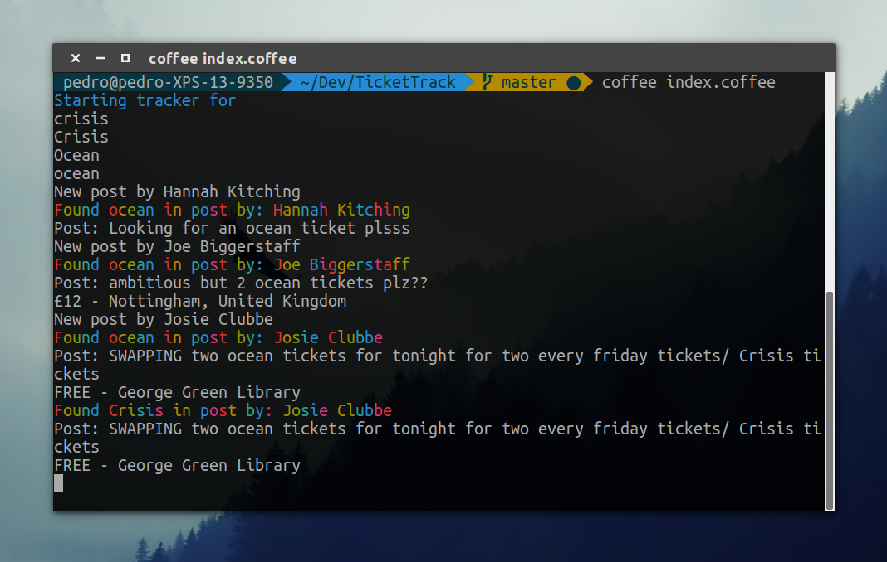

# Ticket Track
Simple application to track buy and sell records


## How does it work
The node app runs on the terminal window and look for specific keywords on the Nottingham Buy/Sell group, this is perfect for sniping tickets.

## Setup
To run the program you need to make a config.json file. Just make a file called config.json and paste the following. You also need to get a Graph Facebook token. You can get one from [Facebook graph API explorer](https://developers.facebook.com/tools/explorer/).

```json

{
	"token" : "{place your token here}",
	"keywords":
	[
		"crisis",
		"Crisis",
		"Ocean",
		"ocean"
	]
}
```
You can add and remove keywords as you like make sure you have commas in between them, and all keywords do not contain spaces.

## Usage
To use it run the program either with node or coffee either use
```bash
	node index.js
```
or
```bash
	coffee index.coffee
```

### Facebook related problems.
Unfortunately Facebook access tokens have an will expire after a certain amount of time, you can always make more but if you start getting errors you will have to create another one on the same page. If this is a major problem I could implement Facebook login inside the application.

### More problems
Because the Facebook api is not really consistent when it comes to ordering the results(I think this is due to comments) you might get false positives. The program does show the post so those a quite easy to catch. I am aware of this problem and I'm gonna fix it

#### Upcoming features
- [ ] A super step by step guide on how to actually use this thing
- [ ] Improved consistency on results
- [ ] Conditional keywords(aka only selling or only buying)
- [ ] Online service
- [ ] Desktop application
- [ ] Mobile app?

# Questions
Pedro at [peumendonca@gmail.com](mailto:peumendonca@gmail.com)
